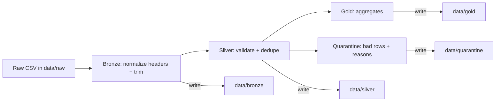

# nfl-injuries-mini-local

A **tiny, local-only** Medallion pipeline (**Raw → Bronze → Silver → Gold**) for **NFL injury CSV** data.

This is the **simpler** version of `nfl-injuries-local`:
- ✅ keeps the same end-to-end flow
- ✅ keeps quarantine (bad rows do NOT break the batch)
- ✅ keeps one file per stage (bronze / silver / gold)
- ✅ keeps virtual env + Makefile
- ✅ keeps a schema config file (barebones JSON)
- ❌ removes ruff linting/formatting
- ❌ removes separate `config.py` and `io.py` modules

---

## What you get (outputs)

After running `make run`, you get:

- **Bronze**: `data/bronze/injuries_bronze.csv`  
  Standardized ingest copy (normalized headers + trimmed strings).

- **Silver**: `data/silver/injuries_silver.csv`  
  Clean, validated rows only.

- **Quarantine**: `data/quarantine/injuries_quarantine.csv`  
  Bad rows + `quarantine_reason` (pipeline still completes).

- **Gold**:
  - `data/gold/injuries_by_team_week.csv`
  - `data/gold/injuries_by_position.csv`

---

## Folder structure

```text
nfl-injuries-mini-local/
|
├── data/
│   ├── raw/                # Source CSV(s) live here (never modified)
│   ├── bronze/             # Raw ingest copy with normalized headers
│   ├── silver/             # Clean + validated rows only
│   ├── gold/               # Aggregations for consumption
│   └── quarantine/         # Bad rows + reasons
|
├── schema/
│   └── injuries_schema.json  # Barebones schema contract
|
├── pipeline/
│   ├── bronze.py           # raw -> bronze
│   ├── silver.py           # bronze -> silver + quarantine
│   ├── gold.py             # silver -> gold
│   └── runner.py           # orchestration
|
├── scripts/
│   └── run_pipeline.py      # beginner-friendly entrypoint
|
├── requirements.txt
├── Makefile
└── .gitignore
```

---

## Quick start

### Requirements
- Python 3.10+

### Run end-to-end

```bash
make run
```

If you prefer running without make:

```bash
python -m venv .venv
source .venv/bin/activate
pip install -r requirements.txt
python scripts/run_pipeline.py
```

---

## Schema contract (barebones)

The pipeline expects the **default training file**:
- `data/raw/injuries_raw.csv`

The schema is defined in:
- `schema/injuries_schema.json`

Example (trimmed):

```json
{
  "required": {
    "season": "int",
    "week": "int",
    "team": "str",
    "player": "str",
    "position": "str",
    "injury": "str",
    "status": "str"
  },
  "optional": {
    "practice_status": "str",
    "report_date": "date"
  },
  "primary_key": ["season", "week", "team", "player", "injury"],
  "week_range": [1, 22]
}
```

Notes:
- This is intentionally **not** a full-blown schema framework.
- It’s just enough to practice the idea of a data contract and validation.

---

## Silver validation rules (what gets quarantined)

Silver applies a few clean rules you’ll see constantly in real pipelines:

1. **Schema validation (file-level)**
   - If any **required columns** are missing, the run fails fast.

2. **Null / blank checks (row-level)**
   - Required fields cannot be null or blank.

3. **Type checks (row-level)**
   - `season` and `week` must be integers.

4. **Range check (row-level)**
   - `week` must be within `week_range` (default: 1..22).

5. **Date check (row-level, optional)**
   - If `report_date` exists, it must parse as a date (`YYYY-MM-DD` recommended).

6. **Duplicate check (row-level)**
   - Duplicates by `primary_key` are quarantined (the first instance is kept).

Quarantine rows get a `quarantine_reason` string, e.g.:

```text
missing_required_field; invalid_week; duplicate_record
```

---

## Architecture



---

## Common tweaks you’ll actually do in real life

- **Change the primary key** (schema file):
  - If your source has `player_id`, use that instead of `player`.

- **Adjust validation strictness**:
  - Maybe you allow blank `injury` but require `status`.

- **Add one more Gold output**:
  - Example: injuries by `status` and `team`.

---

## Troubleshooting

- If imports fail, you ran the script from the wrong folder.
  - Run from the repo root:
    - ✅ `python scripts/run_pipeline.py`

- If everything is quarantined, your raw CSV probably doesn’t match the schema.
  - Fix the schema JSON or rename columns in Bronze.

---

## License

MIT.
# nfl-injuries-mini-local
